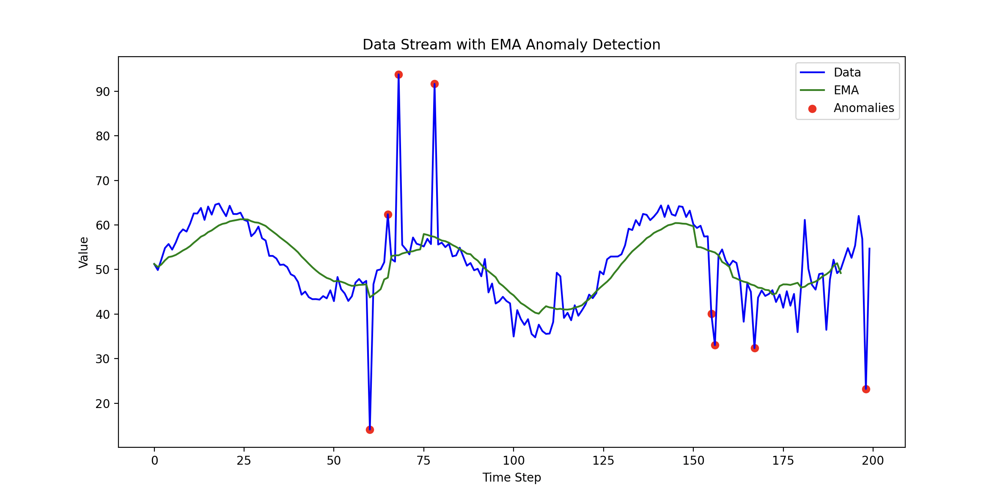

# Efficient Data Stream Anomaly Detection

### Overview
This is an anomaly detection system using the **Exponential Moving Average (EMA)** algorithm. It is effective in identifying unusual values in a simulated real-time data stream.

### Exponential Moving Average (EMA) Algorithm
The Exponential Moving Average (EMA) Algorithm works by placing a greater weight on the most recent data points. It is a very simple algorithm that is able to adapt to recent change and still detect anomalies. It has three parameters **alpha, threshold, and warmup_period.** 

**Alpha** gives an exponentially decreasing weight to older data points. Alpha must be between 0 and 1. If alpha is closer to 1, it means EMA will react more strongly to recent changes making it more responsive but also more volatile. If alpha is lower, closer to 0, it makes the EMA slower to react to new values which is useful for reducing noise. 

**Threshold** is a positive value that is used to determine whether the deviation between the current value and EMA is large enough to be considered an anomaly or not. If the difference exceeds this threshold, then the point is considered an anomaly. 

**Warmup_values** and the **warmup_period** are used to get a stable initial EMA. Instead of just assigning the first data value as the initial EMA, warmup values are used to calculate the initial EMA and are not considered with anomaly detection. This approach addresses an edge case where the very first value can be an anomaly. If the initial EMA is assigned to this first value it could result in incorrectly flagging the next few values as anomalies, even if they are not. 

**Effectiveness:** EMA is a very efficient algorithm that is able to process each data point in constant time. The EMA algorithm also only stores the current EMA value and a few warmup values which makes it extremely memory efficient. 

Here is how it works:

Let’s say that alpha= 0.1. This means that the latest value’s weight is 10%. If the previous EMA= 55 and the current value =60. To get the new EMA, we would take the 10% weight of the current value and add it to the 90% of the previous EMA to get the new EMA:

0.1*60 =6

(1-0.1)*55=49.5

6+ 49.5 = 55.5

Now, the current EMA = 55.5. It had a 90% influence from the previous values and a 10% influence from the new value. EMA can detect anomalies while filtering out small, insignificant fluctuations.

### How to Run the Project

**Requirements**:
- Python 3.x installed
- This project works without installing the dependencies which are just for visualization. To install dependencies use the following command:
  ```sh
  pip install -r requirements.txt
  ```
  If Matplotlib is not installed, the project will skip visualization and continue with console output only.
  If Matplotlib is installed, the system will generate a plot in the end showing:
  - The **Data Stream** (blue)
  - The **EMA** (green)
  - **Anomalies** (red)
  
 Run the main script:
```sh
python main.py 
```

### Example Output
**Console Output** (without visualization)
```
Value 0: 48.27 (EMA:48.27)
Value 1: 51.24 (EMA:49.76)
Value 2: 51.87 (EMA:50.46)
Value 3: 53.46 (EMA:51.21)
Value 4: 54.22 (EMA:51.81)
Value 5: 57.78 (EMA:52.41)
Value 6: 28.80 (Anomaly Detected)
Value 7: 59.81 (EMA:51.02)
Value 8: 58.00 (EMA:51.72)
```

### Example Visualization
